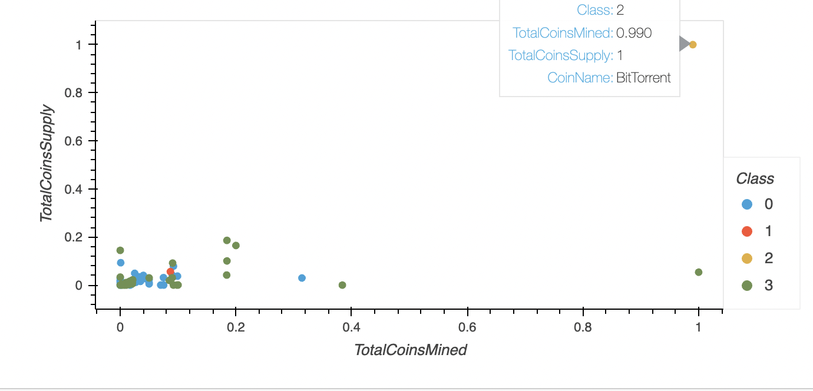
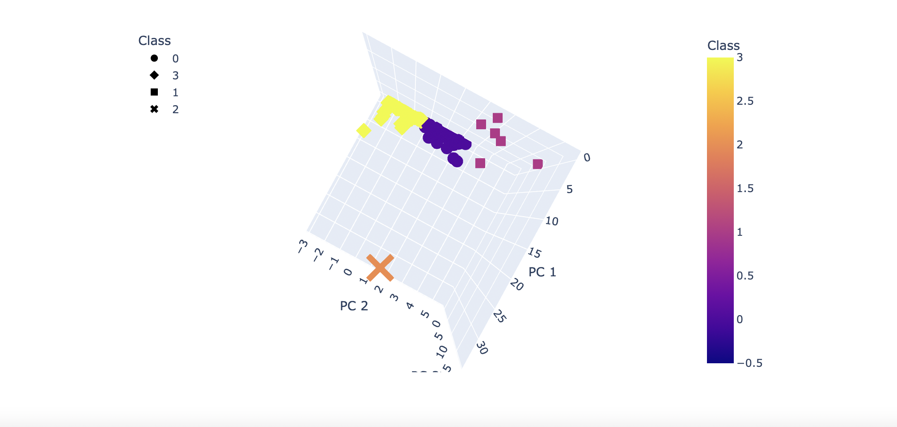

# Cryptocurrencies

## Purpose of this project

### This project's involved taking a cryptocurrency dataset:

### Preprocessing for PCA
### Reducing with PCA
### Clustering with KMeans
### Using Plotly Express and hvplot to create visualizations in 2D and 3D

## Source data

### The steps taken are in the crypto_clustering.ipynb file. It was used to create the following interactive 2D and 3D visualizations of the cryptocurrency data:

